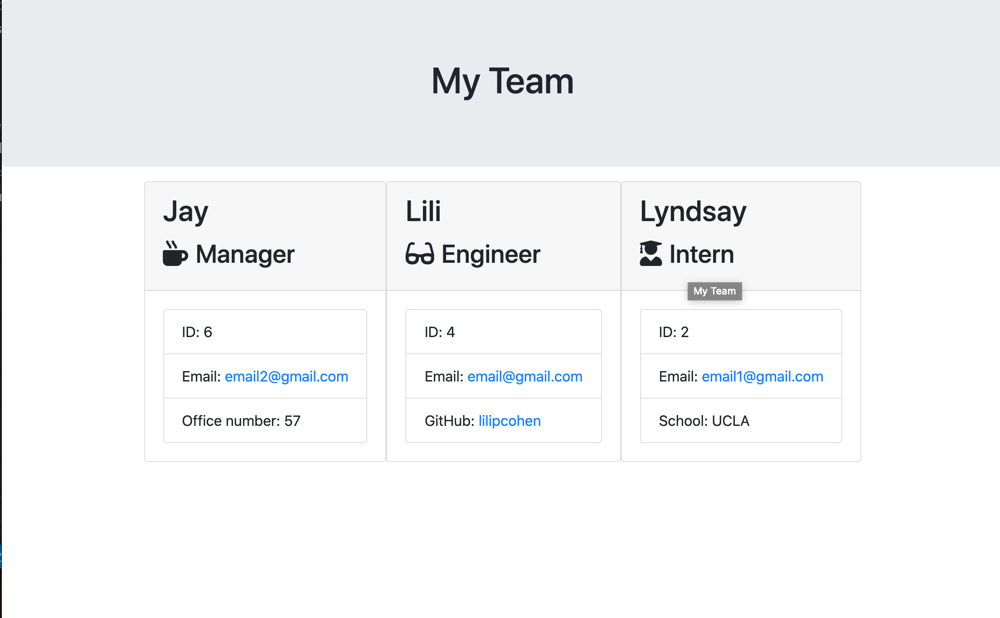

# employee-summary

## Overview

This project, I was to use node and the inquirer package to dynamically generate an employee information card for a user. The user is to use command line or terminal after cloning the repo, installing the inquirer package with "npm install", and enter "node app.js". This will prompt users to answer a series of questions that correlate to generating their employee(s) information and a team summary file with their inputs.

## photos

[ Click here for a Video Tutorial](https://drive.google.com/file/d/1OvyhS6oOaMduygBs8jrmFfCa9m2bzoak/view)

